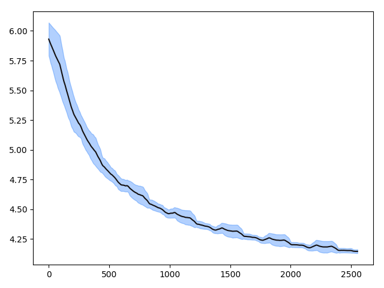

# The source code for *Multi-Lingual Question Generation with Language Agnostic Language Model*

This repo is the source code for our ACL/IJCNLP2021 finding paper *Multi-Lingual Question Generation with Language Agnostic Language Model* 

## Pre-processing

### 1.Download and precess the wikidumps

First of all, you should download the wikipedia dumps from [https://dumps.wikimedia.org/](https://dumps.wikimedia.org/ ) , basicly, there are 10 languages used in this paper for pre-training.

|    Language    | Short name | Size |
| :------------: | :--------: | :--: |
|    Chinese     |     zh     | 1.4G |
|    English     |     en     | 14G  |
|     Korean     |     ko     | 679M |
|     French     |     fr     | 4.4G |
|     Hindi      |     hi     | 430M |
|    Burmese     |     bu     | 208M |
|     German     |     de     | 5.8G |
|    Vietnam     |     vi     | 979M |
|    Japanese    |     Ja     | 2.8G |
| Chinese Minnan |     mi     | 124M |

Note that the number of pre-training languages could be larger than the fine-tuning languages.

You should downloads the original wikidumps file containing the whole articles, such as jawiki-20200420-pages-articles.xml.bz2. And then using [WikiExtractor](https://github.com/attardi/wikiextractor) to extract the paragraphs. For example:

```bash
python3 WikiExtractor.py  -b 100m -o raw/ jawiki-20200420-pages-articles.xml.bz2
```

This extract the text of japanese wikidumps into the raw directory.

### 2. Merge the text into a single file

Then we merge the wiki text files processed by Wikextractor into a single file, which are then used to train the sentencepiece tokenizer in [step3](###3. Train the sentencepiece tokenizer)  The code we provided is `preprocess/process_wiki_data.py`

```python
def check_valid_wiki_passage(txt):
    if txt.startswith('<doc id'):
        return False
    if txt.startswith('</doc>'):
        return False
    if len(txt) < 10:
        return False
    return True
  
def get_all_wiki_data(language='english'):
    raw_file_paths = get_dir_files('data/{}/raw'.format(language))
    data = []
    for one_file in tqdm(raw_file_paths):
        for line in get_file_info(one_file):
            if check_valid_wiki_passage(line):
                data.append(line.strip())
    output_filename = 'data/{}/wiki.all.txt'.format(language)
    print('dump {} wiki total size is {}'.format(language, len(data)))
    write_lst_to_file(data, output_filename)
    print('{} done!'.format(language))
```

Where we get the text between two xml tags and filter out the lines shorter than 10.

### 3. Train the sentencepiece tokenizer

For each language, we use google's [sentencepiece](https://github.com/google/sentencepiece) library to learn the tokenizer automatically. We use the unigram language model. And the code is `preprocess/process_wiki_data.py` 

```python
def train_vocab(language='english', vocab_size=30000):
    sp_path = 'data/{}/wiki.all.txt'.format(language)
    content = '--input=' + sp_path + ' ' \
                                     '--model_prefix=/search/odin/bingning/data/LALM/language_slot/vocab.my_size --vocab_size=my_size ' \
                                     '--character_coverage=0.9999 ' \
                                     '--num_sub_iterations=2 ' \
                                     '--max_sentencepiece_length=36 ' \
                                     '--model_type=unigram --num_threads=40 --max_sentence_length=15000 ' \
                                     '--input_sentence_size=2000000 '

    content = content.replace('my_size', str(vocab_size))
    content = content.replace('language_slot', language)
    spm.SentencePieceTrainer.Train(
        content
    )
```

where the language parameters are the respective language processed in previous step. The default vocabulary size is 30,000.

## Pre-training

After processing the original wiki dumps and obtaining the tokenizer, we then pretrain the LALM.

There are two types of model we can pre-train,

* LALM_shared, where we don't discriminate any languages, and the low-level module is directly fed to the high-level module.
* LALM, we add a discriminator and adopt adversarial training to make the high-level module more language-agnostic.

Our pre-training code is provided in `train/pre_train_lalm.py` . And you can run the script by :

```bash
sh run_pre_train.sh
```

where the `run_pre_train.sh` is 

```bash
#!bin/bash

python3 -m torch.distributed.launch --nproc_per_node=4 pre_train_lalm.py \
--batch_size=24 \
--max_learning_rate==1e-4 \ 
--max_length==512 \
--n_embedding==128 \
--n_hidden==768 \
--n_layer==12 \
--n_head==12 \
--reload=False \
--epoch=-1 \
--type=shared \
--zh_path='data/chinese/wiki.all.txt' \
--en_path='data/chinese/wiki.all.txt' \
--ko_path='data/korean/wiki.all.txt' \
--fr_path='data/french/wiki.all.txt' \
--hi_path='data/hindi/wiki.all.txt' \
--bu_path='data/burmese/wiki.all.txt' \
--de_path='data/german/wiki.all.txt' \
--vi_path='data/vietnam/wiki.all.txt' \
--ja_path='data/japanese/wiki.all.txt' \
--mi_path='data/minnan/wiki.all.txt'
```

Where the `reload` parameter means whether to reload previous pre-trained model from checkpoints, and epoch is the pre-load checkpoint's number.

`type` can be either `shared` or `lalm`

We also provid the training curve from our enviroments, where we 4 NVIDIA-V100 16Gb GPUs.



Note that the final average loss is around 3.5 for LALM_share.

## Fine-tuning

### 1.Preprocess the training question generation data

First of all, we should pre-process the question answering datasets. We process the data and transform it into a list of items, where each item is [context, document_features, questions] and each question is [question, question_features]. The process script is in `preprocess` directory, an example of English SQuAD is shown below.

```python
sp = spm.SentencePieceProcessor()
sp.load('../data/vocab/english.30000.model')


def one_paragraphs(paragraphs):
    one_data = []
    for paragraph in paragraphs["paragraphs"]:
        context = paragraph['context']
        doc_ids = sp.EncodeAsIds(context)
        questions = []
        for qa in paragraph["qas"]:
            question_text = qa["question"]
            question_ids = sp.EncodeAsIds(question_text)
            questions.append([question_text, question_ids])
        one_data.append([context, doc_ids, questions])
    return one_data


def process(filename):
    with open(filename) as dataset_file:
        dataset_json = json.load(dataset_file)
        dataset = dataset_json['data']
    output = multi_process(one_paragraphs, dataset, num_cores=40)
    output = [y for x in output for y in x]
    if 'train' in filename:
        output = [[x[1], y[1]] for x in output for y in x[2]]
    print('{} proceed done, have {} samples'.format(filename, len(output)))
    return output


def get_squad():
    dev = process('../data/qg/english.dev.json')
    dump_file(dev, '../data/qg/dev.en.obj')
    train = process('../data/qg/english.train.json')
    dump_file(train, '../data/qg/train.en.obj')


if __name__ == '__main__':
    get_squad()
```


Since we do not hold the licence to distribute the data, so we refer them below so you can obtain this data by yourself.

| Language | Training data size | Dev data size |                             url                              |                     Info                      |
| :------: | :----------------: | :-----------: | :----------------------------------------------------------: | :-------------------------------------------: |
| English  |       87,599       |     2,067     |         https://rajpurkar.github.io/SQuAD-explorer/          |   english.dev.json/english.train.json, V1.1   |
|  Korean  |       60,407       |      964      | https://github.com/graykode/KorQuAD-beginner/tree/master/config |                                               |
|  French  |       20,731       |      768      |                  https://fquad.illuin.tech/                  |                                               |
|  Hindi   |       4,000        |     2,555     | https://www.cse.iitb.ac.in/~ganesh/HiQuAD/clqg/clqg_data.tar.gz | decompress the tar file into hindi directory. |
| Chinese  |      180,000       |    44,962     |                                                              |                                               |

### 2. Fine-tuning

todo


